<h1>
# Hello, DEVS!  
</h1>

<!---aa--->
<!---aa--->
 
<h3>
 I am ROHAN SAINI from Jagadhri, Yamunanagar, Haryana. I am currently in Pre-Final year of B.Tech in Computer Science and Engineering From University Institute of Enigineering and Technology, Kururkshetra University Kurukshetra with 8.87 CGPA and at the Diploma level of B.Sc (ONLINEDEGREE) in Data Science and programming from IIT Madras with 7.8 CGPA.
</h3>

<h3>
Highly Skilled at :- 
<ol>
<li>Languages:- Python, C\C++</li>
<li>Front-End Web:- HTML, CSS, BootStrap</li>
<li>Back-End Web:- Django, Flask</li>
<li>DataBase :- MySQL</li>
<li>Problem Solving</li>
<li>Machine Learning, Computational Thinking</li>
<li>Git, GitHub</li>
</ol>
</h3>

<h3>
Linkedin Skilled at :- 
<ol>
<li>Pyhton</li>
<li>C\C++</li>
<li>HTML</li>
<li>SQL</li>
</ol>
</h3>
<h3>
 Now Learnng Data Structures and Algorithms and Practising Concepts on Codeforces, Codechef, Hackerrank. Alongwith it also Learning Python back-end web development framework "Django" and creating major projects in it. Please visit repos. to check my work. Follow me for more such awsome projects.
</h3>
<h3> CONNECT WITH ME </h3>

     
  
     
<h1> GITHUB PROFILE</h1>
     

 
 

     
<h1> 🧰 Toolkit  </h1>

